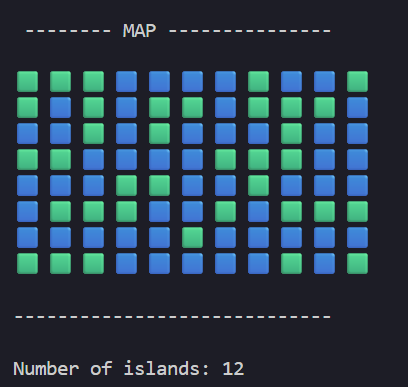
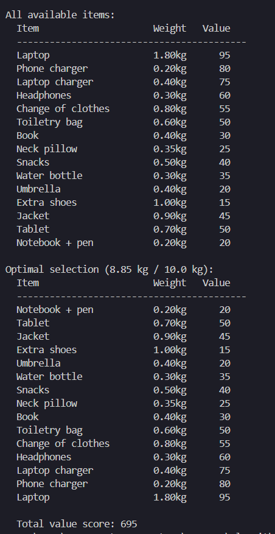
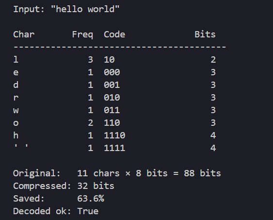

# Algorithms and Data Structures

Personal implementations from TDT4120 at NTNU, plus a couple of small applied projects.
Written in Python.

---

## fundamentals/

| Topic | Implementations |
|---|---|
| `sorting/` | Bubble, insertion, merge, quick, heap, counting, bucket, radix, randomized select |
| `graphs/` | BFS, DFS, Kosarajus, Kruskal, Ford-Fulkerson (Edmonds-Karp) |
| `graphs/shortest_path_from_one_to_all/` | Dijkstra, Bellman-Ford, DAG shortest path |
| `graphs/shortest_path_all_to_all/` | Slow/fast APSP, Floyd-Warshall, transitive closure |
| `trees/` | BST, max-heap, rooted tree, first-child-next-sibling |
| `dynamic-programming/` | Fibonacci, knapsack, LCS, rod cutting, coin change |
| `greedy-algorithms/` | Activity selection, fractional knapsack, Huffman coding |

## projects/

| Project | Description |
|---|---|
| `scc_module_dependency/` | Finds circular dependencies between modules using Kosaraju's SCC |
| `dfs_islands/` | Counts islands in a grid using DFS |
| `packing_assistant/` | Knapsack-based packing helper |

---

Screenshots of projects

### DFS Islands

### Packing Assistant

### Huffman coding

