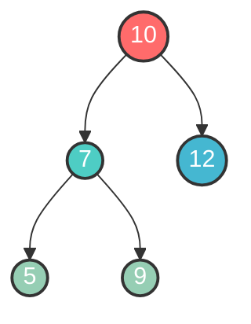
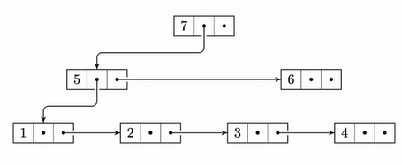

# Rooted trees

### Overview
A rooted tree is a fundamental data structure that consists of nodes connected together in a hierarchical structure. It has a root node which works as the entry point to the tree, and every other node can be reached with a unique path through the root.

Rooted trees are used as basis for other datastructures, such as:
- **binary trees**: Each node has a maximum of two children
- **Heap**: Used in priorityqueues and sorting algorithms

### Properties
- The tree is acyclic (no circles)
- Each node has a maximum of one parent
- The root is unique, and all nodes are available through the root

### Applications
Rooted trees are often used for:
- Hierarchical datastructures, like filesystems
- Representations of expressions and syntax trees in compilers
- Efficient search and insertion when extended to search trees or balanced variants

 

# Rooted trees with linked siblings (First-child/Next-sibling)

### Overview
This tree is a variant of rooted trees where each node has two pointers:
- `first_child`: point to the nodes first children
- `next_sibling`: points to the nodes next sibling

This representation let us have a arbitrary amount of children per node, while the tree is easy to traverse.

