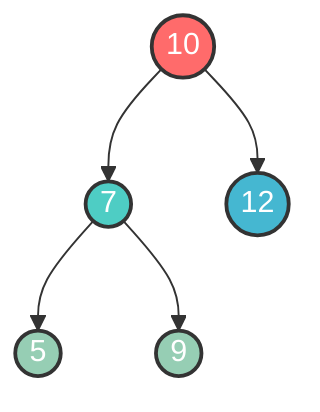

# Rooted trees

```mermaid
graph TD
    A((10)):::root --> B((7)):::left
    A --> C((12)):::right
    B --> D((5)):::leaf
    B --> E((9)):::leaf
    
    classDef root fill:#ff6b6b,stroke:#333,stroke-width:2px,color:#fff
    classDef left fill:#4ecdc4,stroke:#333,stroke-width:2px,color:#fff
    classDef right fill:#45b7d1,stroke:#333,stroke-width:2px,color:#fff
    classDef leaf fill:#96ceb4,stroke:#333,stroke-width:2px,color:#fff
```
