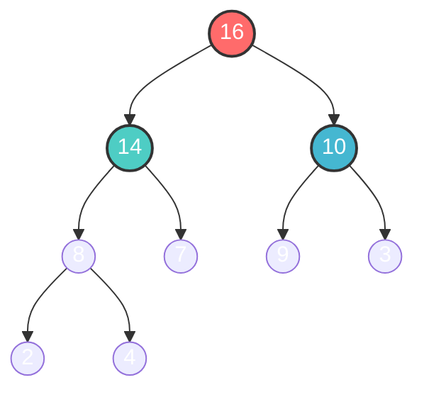

# Rooted trees

### Overview
A rooted tree is a fundamental data structure that consists of nodes connected together in a hierarchical structure. It has a root node which works as the entry point to the tree, and every other node can be reached with a unique path through the root.

Rooted trees are used as basis for other datastructures, such as:
- **binary trees**: Each node has a maximum of two children
- **Heap**: Used in priorityqueues and sorting algorithms

### Properties
- The tree is acyclic (no circles)
- Each node has a maximum of one parent
- The root is unique, and all nodes are available through the root

### Applications
Rooted trees are often used for:
- Hierarchical datastructures, like filesystems
- Representations of expressions and syntax trees in compilers
- Efficient search and insertion when extended to search trees or balanced variants

### Terminologi
- Ordered Tree: Nodes children has a spesific order which traversing also follows
- Unordered Tree: Nodes children has no spesific order (FamilyTree for example)
- Binary Tree: Each node has max. 2 children with no order on the children
- Balanced Tree: The height difference between left and right subtree for each node is <= 1

### Traversing-methods
Traversing is visiting all the nodes in a spesific order.  
The three most common methods are:

| Traversering        |        Order           |           Typical use               |
|---------------------|------------------------|-------------------------------------|
| **Inorder (LNR)**   | Left → Node → Right    |         Sorting and search          |
| **Preorder (NLR)**  | Node → Left → Right    | Copying / building expressiontrees  |
| **Postorder (LRN)** | Left    → Right → Node |    Removal of the tree (delete)     |

 

# Rooted trees with linked siblings (First-child/Next-sibling)

### Overview
This tree is a variant of rooted trees where each node has two pointers:
- `first_child`: point to the nodes first children
- `next_sibling`: points to the nodes next sibling

This representation let us have a arbitrary amount of children per node, while the tree is easy to traverse.

 

# Binary Search Tree (BST)

### Overview
A binary search tree (BST) is a datastructure that organizes elements in a **recursive, ordered tree-structure** so that you could **search, insert and delete** efficient.

Each element is stored in a **node**, and each node has:
- One **key** that is used for comparison
- A **left-pointer** to a child with smaller key
- A **right-pointer** to a child with bigger (or equal) key
- A **parent-pointer** for easier traversing

### Properties
- all keys **to the left** is **less than** the node
- all keys **to the right** is **bigger than or equal to** the node

This property ensures that **inorder-traversing** always gives a **sorted array** of keys

### Searching in a BST

Recursive search (Tree-Search)
For a given key `k`:
1. Start with the root
2. if `k == node.key`, return the node
3. if `k < node.key`, search the left subtree
4. Otherwise search the right subtree

Iterative search:
Same logic as over, but implementer with a `while-loop` instead

 

# Heaps

### Overview
A **heap** is an almost complete binary-tree-structure that fullfills the **heap-properties**:
- In a **max-heap**: value of each node is **>=** value to the children (root always the biggest)
- In a **min-heap**: value of each node is **<** value to the children (root always the smallest)

### Binary heap and array-representation
The heap is a *complete binarytree*, so it can be represented in an array:

For a node with index `i`:
- left(i) = 2 * i (+ 1)
- right(i) = 2 * i + 1 (+1)
- parent(i) = (i (-1)) // 2

This makes the heap very effective to implement

# Priorityqueue

### Overview
A priorityqueue is an abstract datastructure that handles elements with *priorities*

### Operations you can do
- **insert** elements (INSERT)
- **Get the element with highest priority** (EXTRACT-MAX)
- **look at highest priority without removing** (MAXIMUM)
- **increase priority to an elemnt** (INCREASE-KEY)

| Operation     | Complexity |
|---------------|------------|
| `MAXIMUM`     | O(1)       |
| `EXTRACT-MAX` | O(log n)   |
| `INSERT`      | O(log n)   |
| `INCREASE-KEY`| O(log n)   |

## Applications
- CPU job queues
- Network routing (Dijkstra’s algorithm)
- Implementation of heapsort

## Visualization (Max-heap)

